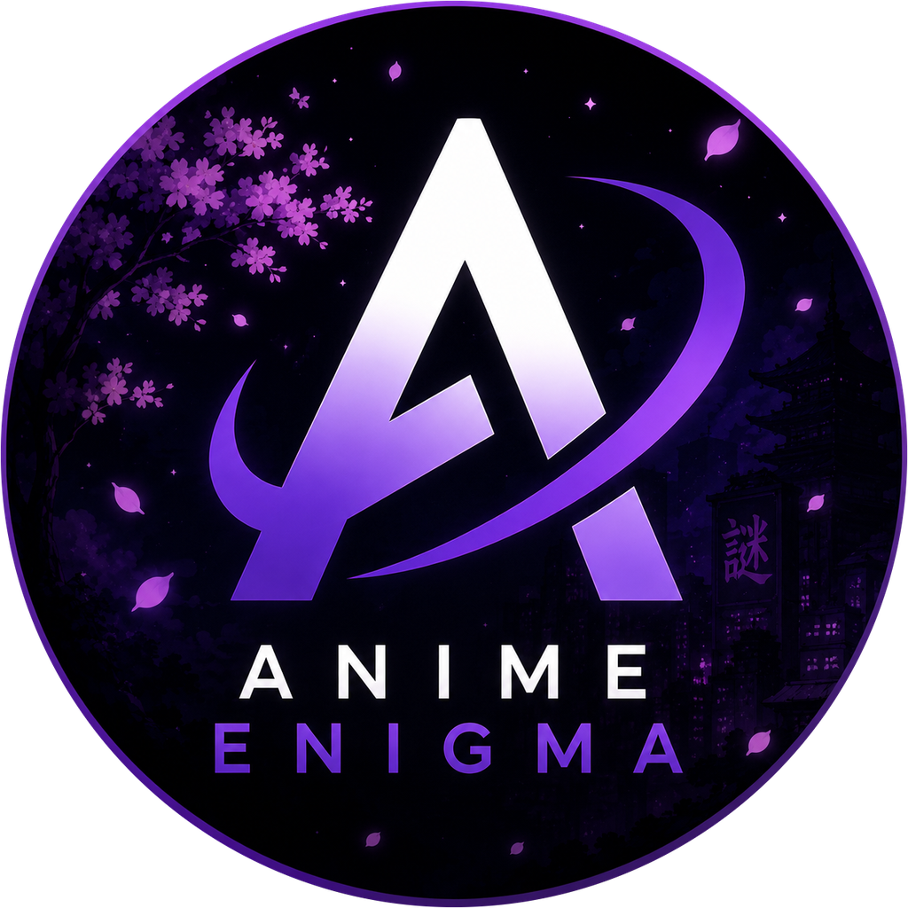

# AnimeEnigma → Discord Rich Presence

<p align="center">
  
</p>

<p align="center">
  <strong>Show what you’re doing on <a href="https://animeenigma.org">animeenigma.org</a> in your Discord profile</strong>
</p>

<p align="center">
  <a href="https://github.com/maxcan2work/animeenigma-activity-ds-extension/releases"></a>
  <a href="https://github.com/maxcan2work/animeenigma-activity-ds-extension/actions"></a>
  
</p>

**On this page**

- [Install](#install)
- [Why not the Chrome Web Store?](#why-not-the-chrome-web-store)
- [Features](#features)
- [Why a local bridge?](#why-a-local-bridge)
- [Quick start](#quick-start)
- [Environment](#environment)
- [Requirements](#requirements)
- [Develop / package](#develop--package)
- [FAQ](#faq)

---

## Install

### From a GitHub Release

1. Open [Releases](https://github.com/maxcan2work/animeenigma-activity-ds-extension/releases)
2. Download `animeenigma-discord-presence-v*.zip` and unzip it
3. Chrome → `chrome://extensions` → enable **Developer mode** → **Load unpacked** → select the unzipped folder
4. Keep reading [Quick start](#quick-start) to run the local bridge (required for Discord status)

### From source

1. Clone this repo
2. Load the `extension/` folder the same way (**Load unpacked**)
3. Configure and start the bridge as in [Quick start](#quick-start)

> The extension alone is not enough — Discord Rich Presence needs the local bridge next to Discord Desktop.

### Why not the Chrome Web Store?

We’d love a one-click **Add to Chrome** button. Publishing there means a paid developer account, review queues, and ongoing store overhead — and we’re not sure this side project needs that bill yet.

So for now: GitHub Releases + Developer mode. If the project grows and the $5 (plus the paperwork) clearly pays for itself, Store listing is an easy next step.

---

## Features

| Feature | What it does |
|---|---|
| **Watching anime** | Shows the title and `Episode N of M` |
| **Site pages** | Home, catalog, gacha, themes, profile, games, and more — with playful localized lines |
| **Languages** | RU / EN / JP for status text and Discord buttons |
| **Buttons for friends** | Open the site · Watch too · optional profile link |
| **Focused tab only** | Multiple tabs or windows (including normal + incognito) don’t fight — last focused wins |
| **Rate-limit aware** | Updates coalesce to Discord’s ~15s Rich Presence window |
| **Optional API key** | Live “watching” from AnimeEnigma when you’re not on the player tab |
| **Friendly popup** | Toggles, language switcher, autosave; bridge address hidden under **Advanced** |

Example status:

```text
Watching AnimeEnigma
Bocchi the Rock!
Episode 7 of 12
```

```text
Competing in AnimeEnigma
In gacha
Just one more pull…
```

---

## Why a local bridge?

Discord Rich Presence is **not** something a Chrome extension can set by itself.

| Piece | Runs where | Job |
|---|---|---|
| **Extension** | Browser | Sees which AnimeEnigma page you’re on |
| **Bridge** | Your PC (`127.0.0.1`) | Talks to **Discord Desktop** via IPC and sets the status |
| **Discord Desktop** | Your PC | Shows *Watching / Competing* on your profile |

```text
  animeenigma.org tab  ──HTTP──►  local bridge :3847  ──IPC──►  Discord Desktop
       (extension)                   (Node app)                    (Rich Presence)
```

Chrome cannot open Discord’s desktop IPC socket. The small companion on localhost exists because of that limitation — not because we enjoy ports.

### About port `3847`

- Default address: `http://127.0.0.1:3847`
- Bound to **localhost only** (not exposed to the internet)
- The extension talks to that URL; Discord never needs the port
- Change it only if something else already uses `3847`: set `BRIDGE_PORT` in `.env`, restart the bridge, then open the extension popup → **Advanced** → paste the new address

Most people never open Advanced.

---

## Quick start

### 1. Discord Application ID

1. Open the [Developer Portal](https://discord.com/developers/applications) → **New Application** (name it `AnimeEnigma` — that string appears in the status).
2. Copy **Application ID** (Client ID).
3. Optional: **Rich Presence → Art Assets** → upload [`assets/discord/logo.png`](assets/discord/logo.png) as asset name `logo`.

No bot token. No user token. No OAuth secret.

### 2. Configure and run the bridge

```bash
git clone https://github.com/maxcan2work/animeenigma-activity-ds-extension.git
cd animeenigma-activity-ds-extension
cp .env.example .env
# put DISCORD_CLIENT_ID=... into .env

cd bridge
npm install
npm start
```

Keep **Discord Desktop** open while the bridge runs.

<details>
<summary><strong>Optional: AnimeEnigma API key</strong></summary>

<br>

In your site profile, create a personal API key (`ak_…`) and set `ANIMEENIGMA_API_KEY` in `.env`.

Used for:

- `GET /api/users/me/activity/current`
- `GET /api/users/me/activity/stream` (SSE)

Docs: [api-docs](https://animeenigma.org/api-docs/) · [openapi.json](https://animeenigma.org/openapi.json)

Without the key, presence still works from the open tab (URL + public anime metadata).

</details>

### 3. Confirm the extension

Open the popup on any AnimeEnigma tab — you should see **Connected**.

Settings (language, profile button, enable/disable) **autosave** a couple of seconds after you change them.

---

## Environment

| Variable | Required | Meaning |
|---|---|---|
| `DISCORD_CLIENT_ID` | yes | Developer Portal → Application ID |
| `ANIMEENIGMA_API_KEY` | recommended | Profile → `ak_…` |
| `BRIDGE_PORT` | no | Default `3847` — only if that port is taken |
| `DISCORD_LARGE_IMAGE_KEY` | no | Art asset name (default `logo`) |
| `ANIMEENIGMA_API_BASE` | no | Default `https://animeenigma.org` |

Copy from [`.env.example`](.env.example). **Never commit `.env`.**

---

## Requirements

- Discord **Desktop** (browser-only Discord cannot host Rich Presence IPC)
- Node.js **18+** for the bridge
- A Chromium browser (Chrome / Edge / Brave / …) for the extension

---

## Develop / package

```bash
npm test                          # bridge unit tests + extension validate
npm run build                     # → dist/animeenigma-discord-presence.zip
```

CI on `main`: test → zip → [GitHub Release](https://github.com/maxcan2work/animeenigma-activity-ds-extension/releases).

The bridge is **not** hosted in the cloud — it has to sit next to Discord on the user’s machine.

---

## FAQ

<details>
<summary><strong>Why isn’t my status updating when I change episodes quickly?</strong></summary>

<br>

Discord accepts Rich Presence updates roughly **once every 15 seconds**. The bridge queues the latest episode and flushes when the window opens — wait a moment and the newest number appears.

</details>

<details>
<summary><strong>Can friends see the buttons?</strong></summary>

<br>

Yes — Discord shows activity buttons to **other people**, not on your own profile card. Labels follow your language setting (for example “Watch too”, “Open profile”).

</details>

<details>
<summary><strong>Two windows or incognito?</strong></summary>

<br>

Presence follows the **last focused** AnimeEnigma tab. Background tabs don’t overwrite it. Normal and incognito share the same local bridge, which picks a single leader by focus time.

</details>

<details>
<summary><strong>Will there be a one-click companion app?</strong></summary>

<br>

That’s the plan — package the bridge so end users don’t need `npm start`. Until then, the Node bridge is the supported companion.

</details>

---

<p align="center">
  Built for <a href="https://animeenigma.org">AnimeEnigma</a> · Presence powered by Discord Desktop RPC
</p>
